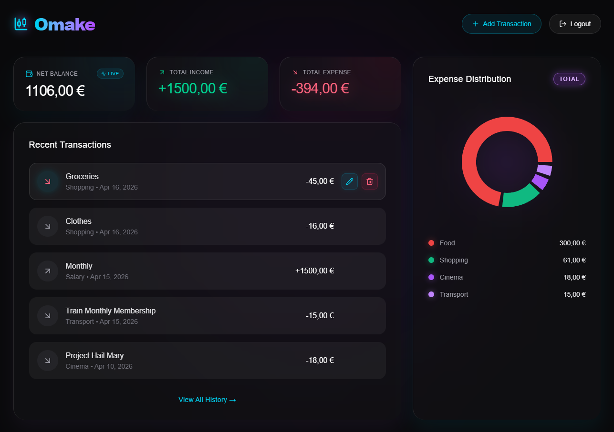
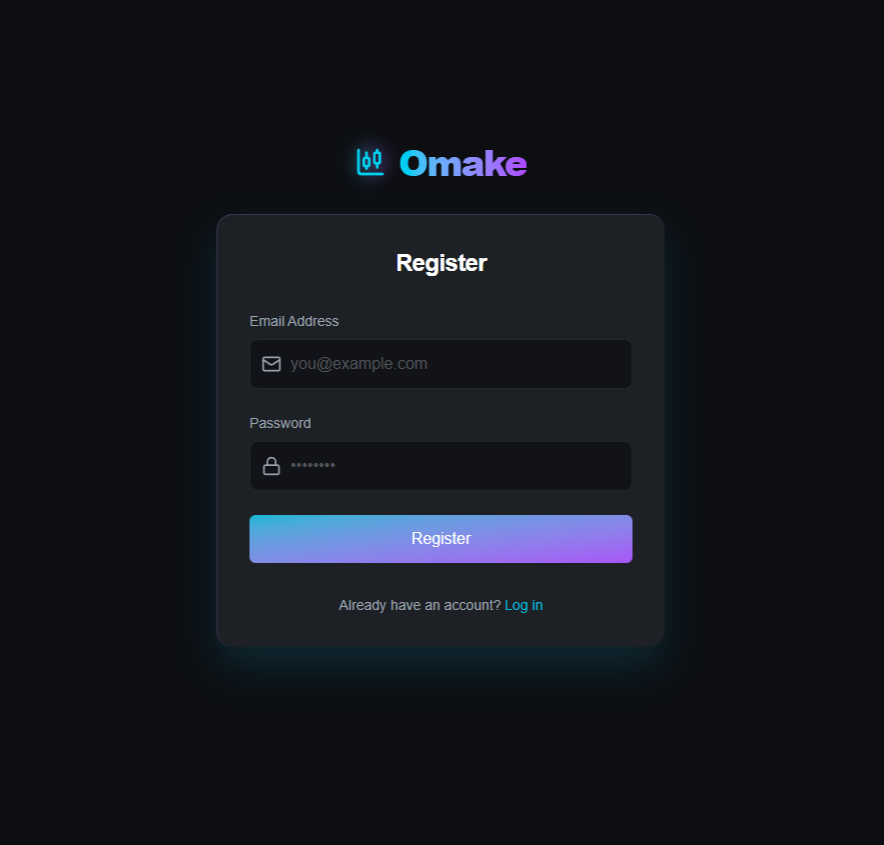
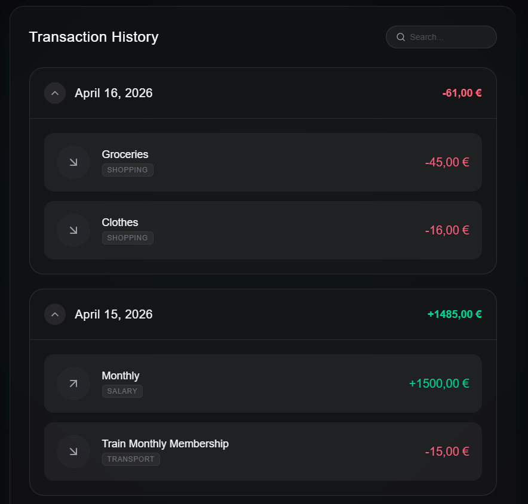

# Omake - Premium Expense Tracker

Omake is a secure, full-stack financial dashboard designed to provide a visually stunning, insightful, and comprehensive experience for tracking your personal finances.



## Tech Stack

- **Frontend:** 
  
  
  
  
- **Backend:**
  
  
  
  
  
  
- **Database:**
  
- **Infrastructure:**
  

## Key Features & Gallery

- **Secure Authentication:** Robust JWT-based protection ensuring your financial data remains private and safe.
  
  

- **Full CRUD & History:** Complete control over managing your expenses and income with an intuitive full history view.
  
  

- **Interactive Visualizations:** Interactive charts featuring a deterministic color hashing algorithm to ensure consistent categorical representations across various metrics and timeframes.

## Getting Started

Instructions to run the Omake project locally:

### Prerequisites
Ensure you have the following installed on your machine:
- **Java 17**
- **Node.js** (v18+)
- **Maven** (optional if using the included wrapper)

### 1. Backend Setup

1. Open a terminal and navigate to the `backend` directory:
   ```bash
   cd backend
   ```
2. Set up your environment variables. You will need a Neon DB connection string and a JWT secret for authentication. You can set these in your `application.properties` or as environment variables:
   - `SPRING_DATASOURCE_URL` (Your Neon PostgreSQL DB URL)
   - `SPRING_DATASOURCE_USERNAME` (Your DB Username)
   - `SPRING_DATASOURCE_PASSWORD` (Your DB Password)
   - `JWT_SECRET` (A strong secret string)
3. Run the Spring Boot backend server:
   ```bash
   ./mvnw spring-boot:run
   ```
   > The server will start on `http://localhost:8080`.

### 2. Frontend Setup

1. Open a new terminal and navigate to the `frontend` directory:
   ```bash
   cd frontend
   ```
2. Install the necessary NPM dependencies:
   ```bash
   npm install
   ```
3. Start the Vite development server:
   ```bash
   npm run dev
   ```
   > The application will be accessible at `http://localhost:5173`.

### 3. Running Automated Tests

- **Backend tests** (JUnit & Mockito):
  ```bash
  cd backend
  ./mvnw test
  ```
- **Frontend tests** (Vitest):
  ```bash
  cd frontend
  npm run test
  ```

## Architecture Note

Omake is strictly built upon an **API-First approach**. The `/docs/api-spec.md` acts as the definitive Single Source of Truth for the contract between the RESTful Spring Boot backend and the React Vite Single Page Application (SPA). By clearly separating frontend UI from backend business logic in a decoupled monorepo fashion, the project provides high scalability, simple maintainability, and clean code architecture.
